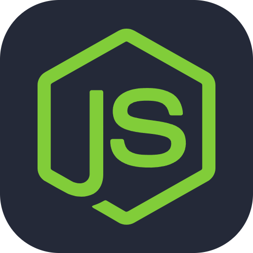
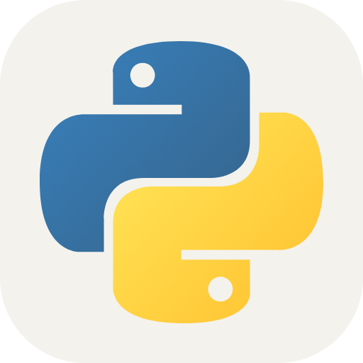

## Hello, I am Jaycheng

* ✨ `My name is`: **Jaycheng**,
* 🪪 `Pronouns`: **He/Him**,
* 🏫 `I'm study in`: **NTUST**,
* 🌱 `I’m currently learning`: **JavaScript**,
* ❤️ `I love`: **Milk tea🧋**  ,
* 🖥️ `Favorite lang`: **JavaScript & Python**

### About me
>化工科, 自學 程式小白，請多多指教!!!

 
<h2 align="center">🍵 Statistics</h2>

### Skills

